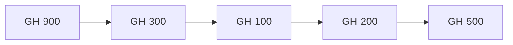

#  GitHub 
 - [GitHub-Collections] [Learn.Microsoft.com](https://learn.microsoft.com/en-us/collections/j2g2u3t6oygznm?)

   
### GitHub Roadmap ###
- [x] [GH-900] GitHub Foundations : 
    [Certification](https://github.com/mjahanseir/Microsoft/blob/main/Github/GH900-Certification.md) | 
    [Labs](https://github.com/mjahanseir/Microsoft/blob/main/Github/GH900-Labs.md) |
    [Questions](https://github.com/mjahanseir/Microsoft/blob/main/Github/GH900-questions.md) 

- [x] (https://github.com/mjahanseir/Microsoft/blob/main/pic/microsoft.png) [GH-300] : GitHub Copilot:
     [Certification](https://github.com/mjahanseir/Microsoft/blob/main/Github/GH300-Certification.md) | 
    [Labs](https://github.com/mjahanseir/Microsoft/blob/main/Github/GH300-Labs.md) |
    [Questions](https://github.com/mjahanseir/Microsoft/blob/main/Github/GH300-questions.md)   
  [GH-100 : GitHub Administration]:
 
  

  [GH-200 : GitHub Actions](https://learn.microsoft.com/en-us/credentials/certifications/github-actions)

   [GH-500 : GitHub Advanced Security](https://learn.microsoft.com/en-us/credentials/certifications/github-advanced-security)

  vPooster: https://aka.ms/CertificationsPoster
