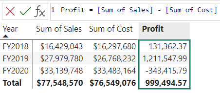
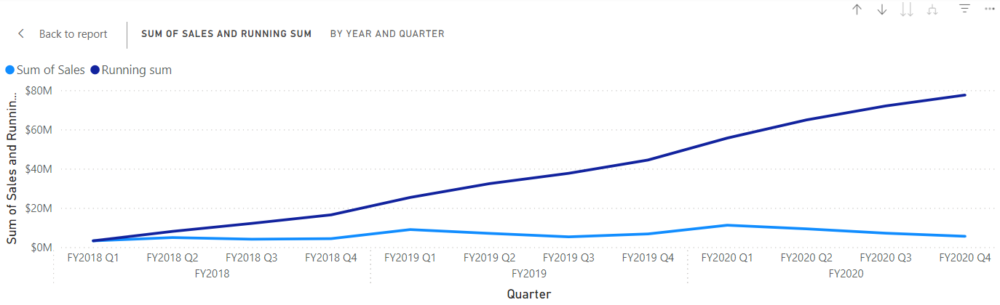
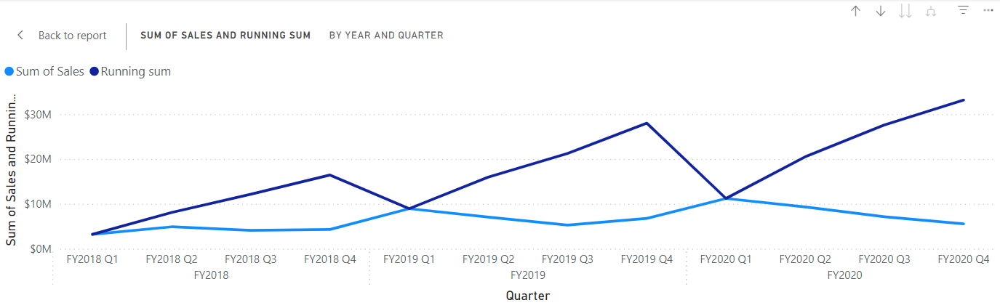

---
lab:
    title: 'Create visual calculations in Power BI Desktop'
    module: 'Create visual calculations in Power BI Desktop'
---

# Create visual calculations in Power BI Desktop

## Lab story

In this lab, you'll create visual calculations using Data Analysis Expressions (DAX).

In this lab, you learn how to:

- Create and edit visual calculations.
- Use PREVIOUS(), RUNNINGSUM() and MOVINGAVERAGE() functions to create comparison metrics between each fiscal year.
- Use the optional Axis parameter when creating comparison metrics.
- Use the optional Reset parameter to customize cumulative calculations in a multi-leveled axis.

**This lab should take approximately 30 minutes.**

## Get started

To complete this exercise, first open a web browser and enter the following URL to download the zip folder:

`https://github.com/MicrosoftLearning/PL-300-Microsoft-Power-BI-Data-Analyst/raw/Main/Allfiles/Labs/07-create-visual-calculations/07-visual-calculations.zip`

Extract the folder to the **C:\Users\Student\Downloads\07-visual-calculations** folder.

Open the **07-Starter-Sales Analysis.pbix** file.

> _**Note**: You may see a sign-in dialog as the file loads. Select **Cancel** to dismiss the sign-in dialog. Close any other informational windows. Select **Apply Later**, if prompted to apply changes._

## Create a bar chart visual

In this task, you’ll create a bar chart showing sales amount, total product cost, and profit by fiscal year, with comparison metrics as tooltips.

1. In the **Visualizations** pane, select the clustered bar chart visual type.

   

1. In the **Data** pane, from inside the **Date** table, drag the **Year** field into the **Y-axis** well/area.

1. Drag the **Sales** and **Cost** fields from the **Sales** table into the **X-axis** well/area.

    > Notice that when you added Sales and Cost to the visual, the sum of each field was automatically calculated.

1. Sort the resulting bar chart by **Year** ascending by using the three-dot menu and selecting **Year** followed by **Sort ascending**:

   

    > You now have a bar chart showing the Sum of Sales and Sum of Cost by Year sorted chronologically.

## Add calculations

1. With the bar chart selected, select **New visual calculation** in the ribbon:

   

1. The visual calculations edit window opens. In the formula bar above the visual matrix enter the following expression and then Enter to commit the calculation:

    ```DAX
   Profit = [Sum of Sales] - [Sum of Cost]
    ```

1. Confirm you now see a Profit column on the visual matrix at the bottom of the screen:

   

1. Expand the menu under **New visual calculation** and select **Versus previous** from the template options:

    > **Versus Previous** compares a value to a preceding value, so we see the Profit compared to the previous value for Year.

   

1. In the formula bar, replace the `[Field]` placeholder with `[Profit]` twice and commit the calculation.

1. Select **Running sum** from the templates menu and replace the `[Field]` placeholder with `[Profit]` and commit the calculation.

    > **Running sum** calculates the sum of values, adding the current value to the preceding values, so we see the total of current and previous years.

1. Select **Moving average** from the templates menu and replace the `[Field]` placeholder with `[Profit]` and the `WindowSize` placeholder with 2. You should now have the following set up:

    > **Moving average** calculates an average of a set of values in a given window by dividing the sum of the values by the size of the window. By setting the window size to 2, we are calculating the average of two consecutive values. In this example, the values are yearly profits, so we see the moving average for FY2019 is the average of the profits for FY2018 and FY2019.

   

1. Under the **X-axis** well/area, select the visibility icon of the following fields to hide them from the visual:

    - Sum of Sales
    - Sum of Cost
    - Profit

   

    > Notice how the fields and calculations you hid are now no longer shown on the visual.

1. In the **Visualizations** pane, drag **Running sum** and **Moving average** to the **Tooltips** well/area.  

1. Confirm the visual now meets the goals. Exit out of the visual calculations edit screen to your report:

   

    > You now have a bar chart with the following values: Sum of Sales, Sum of Cost, Profit, and Profit *versus previous* with tooltips for Profit *running sum* and Profit *moving average*.

## Create a matrix visual

In this task, you'll create a matrix visual that compares the sales amount per category against the first fiscal year for each of the following years.

1. In **Report view**, create a new report page.

1. On **Page 2**, add a matrix visual.

1. Add the following fields to the visual wells/areas:

    - Rows: **Product \| Category**
    - Columns: **Date \| Year**
    - Values: **Sales \| Sales**

    > *The labs use a shorthand notation to reference a field. It will look like this: **Date \| Year**. In this example, **Date** is the table name and **Year** is the field name.*

## Add calculations

1. With the matrix selected, select **New visual calculation** in the ribbon.

1. In the visual calculations edit window, type and save the following calculation:

    ```DAX
   Versus first = [Sum of Sales] - FIRST([Sum of Sales])
    ```

    > Notice how the matrix shows the difference in sales amount for each category versus the first category.

1. Select the field **Versus first** in the **Values** well/area and update your calculation by adding the ROWS value for the Axis parameter to FIRST:

    ```DAX
   Versus first = [Sum of Sales] - FIRST([Sum of Sales], ROWS)
    ```

    > Notice how nothing changes as ROWS is the default value for the Axis parameter.

1. Replace ROWS with COLUMNS and observe that the calculation now compares the sales amount per category against the first fiscal year:

   

    > Notice how the **Versus first** column for the **Total Sales** returns zero instead of the difference against the first fiscal year. **Total Sales** is on a different hierarchical level than the yearly sums, and therefore, considered the first column on that level.

1. Exit out of the visual calculations edit screen to your report.

## Create a line chart visual

In this task, you'll create a line chart that shows the running sum for sales. This sum will reset at the beginning of every fiscal year.

1. In **Report view**, create a new report page.

1. On **Page 3**, add a line chart visual.

1. Add the following fields to the visual wells/areas:

    - X-axis: **Date \| Year** and **Date \| Quarter**
    - Y-axis: **Sales \| Sales**

## Add running sum

1. With the line chart selected, expand the menu under **New visual calculation** and select **Running sum** from the template options.

1. Replace the `[Field]` placeholder with `[Sum of Sales]` and commit the change. The visual should look as follows:

   

## Update running sum to restart every new fiscal year

1. While still in the visual calculations edit window, select the **Running sum** field under **Y-axis** and update the expression for this calculation by adding the HIGHESTPARENT reset parameter and commit the changes:

    ```DAX
   Running sum = RUNNINGSUM([Sum of Sales], HIGHESTPARENT)
    ```

Verify that the running sum indeed restarts for every new fiscal year:

   

## Lab complete

You may choose to save your Power BI report, though it’s not necessary for this lab. In the next exercise, you’ll work with a pre-made starter file.

1. Navigate to the **"File"** menu in the top left corner and select **"Save As"**. 
1. Select **Browse this device**.
1. Select the folder where you want to save the file and give it a descriptive name. 
1. Select the **Save** button to save your report as a .pbix file. 
1. If a dialog box appears prompting you to apply pending query changes, select **Apply**.
1. Close Power BI Desktop.