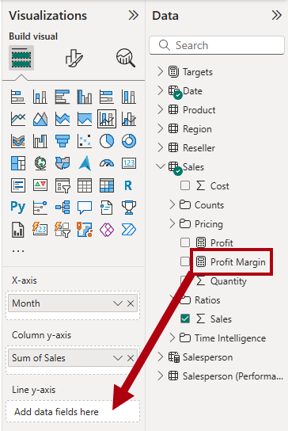
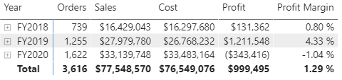

---
lab:
    title: 'Design Power BI reports'
    module: 'Design Power BI reports'
---

# Design Power BI reports

## Lab story

In this lab, you'll create a three-page report. You'll then publish it to the Power BI service, where you'll open and interact with the report.

In this lab, you learn how to:

- Design a report.
- Configure visual fields and format properties.
- Sync slicers.
- Publish the report to the Power BI service.
- Interact with a report and its visuals.

**This lab should take approximately 45 minutes.**

## Get started

To complete this exercise, first open a web browser and enter the following URL to download a zip file:

`https://github.com/MicrosoftLearning/PL-300-Microsoft-Power-BI-Data-Analyst/raw/Main/Allfiles/Labs/08-design-power-bi-reports/08-design-report.zip`

Extract the file to the **C:\Users\Student\Downloads\08-design-report** folder.

Open the **08-Starter-Sales Analysis.pbix** file.

> _**Note**: You may see a sign-in dialog as the file loads. Select **Cancel** to dismiss the sign-in dialog. Close any other informational windows. Select **Apply Later**, if prompted to apply changes._

## Design page 1

In this task, you'll design the first report page. When you've completed the design, the page will look like the following:

1. In Power BI Desktop, to rename the page, at the bottom-left, right-click **Page 1**, then select **Rename**. Rename the page as _Overview_.

    > _Tip: You can also double-click the page name to rename it._

1. To add an image, on the **Insert** ribbon tab, from inside the **Elements** group, select **Image**.

    

1. In the **Open** window, navigate to the **C:\Users\Student\Downloads\08-design-report** folder.

1. Select the **AdventureWorksLogo.jpg** file, and then select **Open**.

1. Drag the image to position it at the top-left corner, and also drag the guide markers to resize it.

    

1. To add a slicer, first de-select the image by selecting an empty area of the report page, then select **Slicer** in the **Visualizations** pane.

    

1. In the **Data** pane, drag the `Date | Year` field (not the `Year` level of the hierarchy) into the slicer **Field** well in the **Visualizations** pane.

    > _The labs use a shorthand notation to reference a field. It will look like this: `Date | Year`. In this example, `Date` is the table name and `Year` is the field name._

    

1. To convert the slicer from a list to a dropdown, in the **Visualizations** pane, select **Format visual**. Expand **Slicer settings**, and then set the **Style** dropdown to **Dropdown**.

    

1. Resize and position the slicer so it sits beneath the image and is the same width as the image.

    

1. In the **Year** slicer, open the dropdown list, select **FY2020**, and then collapse the dropdown list.

    > _The report page is now filtered by year **FY2020**._

    

1. De-select the slicer by selecting an empty area of the report page.

1. Create a second slicer, based on the `Region | Region` field (not the `Region` level of the hierarch).

1. Leave the slicer as a list, and then resize and position the slicer beneath the **Year** slicer.

    

1. De-select the slicer by selecting an empty area of the report page.

1. To add a chart to the page, in the **Visualizations** pane, select the **Line and Stacked Column Chart** visual type.

    

1. Resize and position the visual so it sits to the right of the logo, and so it fills the width of the report page.

    

1. Drag and drop the following fields into the visual:

     - `Date | Month`
     - `Sales | Sales`

1. In the visual fields pane (located in the **Visualizations** pane), notice that the fields are assigned to the **X-axis** and **Column y-axis** wells.

    > _By dragging fields into a visual, they're added to default wells. For precision, you can drag fields directly into the wells, as you'll do next._

    

1. From the **Data** pane, drag the `Sales | Profit Margin` field into the **Line y-axis** well.

    

1. Notice that the visual only has 11 months.

    > _The last month of the year, 2020 June, doesn't have any sales yet. By default, the visual has eliminated months with `BLANK` sales. You'll now configure the visual to show all months._

1. In the visual fields pane, in the **X-axis** well, for the **Month** field, select the down-arrow, and then select **Show items with no data**.

    

    > _Notice that the month **2020 June** now appears._

1. De-select the chart by selecting an empty area of the report page.

1. To add a chart to the page, in the **Visualizations** pane, select the **Stacked Column Chart** visual type.

    

1. Resize and position the visual so it sits beneath the column/line chart, and so it fills half the width of the chart above.

    

1. Add the following fields to the visual wells:

     - X-axis: `Region | Group`
     - Y-axis: `Sales | Sales`
     - Legend: `Product | Category`

1. De-select the chart by selecting an empty area of the report page.

1. To add a chart to the page, in the **Visualizations** pane, select the **Stacked Bar Chart** visual type.

    

1. Resize and position the visual so it fills the remaining report page space.

    

1. Add the following fields to the visual wells:

     - Y-axis: `Product | Category`
     - X-axis: `Sales | Quantity`

1. To format the visual, open the **Format** pane.

    

1. Expand the **Bars** section, and then in the **Color** group, set the **Color** property to a suitable color (to complement the column/line chart).

1. Set the **Data Labels** section to **On**.

    

1. Save the Power BI Desktop file.

    > _The design of the first page is now complete._

## Design page 2

In this task, you'll design the second report page. When you've completed the design, the page will look like the following:

> _**Important**: When detailed instructions have already been provided in the labs, the lab steps will provide more concise instructions. If you need the detailed instructions, you can refer back to other tasks in this lab._

1. To create a new page, at the bottom-left, select the plus icon. When the page is added, rename it as _Profit_.

1. Add a slicer based on the `Region | Region` field.

1. Use the **Format** pane to show the _Select all_ option (located in the **Slicer settings > Selection** section).

1. Resize and position the slicer so it sits at the left side of the report page, and so it's about half the page height.

    

1. Add a matrix visual, and resize and position it so it fills the remaining space of the report page

    

1. Add the `Date | Fiscal` hierarchy to the matrix **Rows** well.

    

1. Add the following five `Sales` table fields to the **Values** well:

     - `Orders` (from the `Counts` folder)
     - `Sales`
     - `Cost`
     - `Profit` (from the `Pricing` folder)
     - `Profit Margin` (from the `Pricing` folder)

    

1. In the **Filters** pane (located at the left of the **Visualizations** pane), notice the **Filters on this page** section (you may need to expand open the pane and scroll down).

    

1. From the **Data** pane, drag the `Product | Category` field into the **Filters on this page** well.

    > _Fields added to the **Filters** pane can achieve the same result as a slicer. One difference is they don't take up space on the report page. Another difference is that they can be configured to achieve more sophisticated filtering requirements._

1. Inside the filter card, at the top right, select the arrow to collapse the card.

1. Add each of the following `Product` table fields to the **Filters on this page** well, collapsing each, directly beneath the `Category` field:

     - `Subcategory`
     - `Product`
     - `Color`

    

1. Save the Power BI Desktop file.

    > _The design of the second page is now complete._

## Design page 3

In this task, you'll design the third—and final—report page. When you've completed the design, the page will look like the following:

1. Create a new page and rename it as _My Performance_.

1. To simulate the performance of row-level security filters, drag the `Salesperson (Performance) | Salesperson` field to the page level filters in the filter pane.

    

1. In the filter card, select **Michael Blythe**.

    > _Data on the report page will now be filtered to display data for Michael Blythe only._

1. Add a dropdown slicer based on the `Date | Year` field, and then resize and position it so it sits at the top-left corner of the page.

    

1. In the slicer, set the page to filter by **FY2019**.

    

1. Add a **Multi-row Card** visual to the page, and then resize and reposition it so it sits to the right of the slicer and fills the remaining width of the page.

    

    

1. Add the following four fields to the visual:

     - `Sales | Sales`
     - `Targets | Target`
     - `Targets | Variance`
     - `Targets | Variance Margin`

1. Format the visual:

     - In the **Callout values** section, increase the font size property to **28pt**.
     - In the **General** tab, in the **Effects** section, set the background color property to a light gray color (such as _White, 10% Darker_) to provide contrast.

        

1. Add a **Clustered Bar Chart** visual to the page, and then resize and position it so it sits beneath the multi-row card visual and fills the remaining height of the page, and half the width of the multi-row card visual.

    

    

1. Add the following fields to the visual wells:

     - Y-axis: `Date | Month`
     - X-axis: `Sales | Sales` and `Targets | Target`

        

1. To create a copy of the visual, press **Ctrl+C**, and then press **Ctrl+V**.

1. Position the new visual to the right of the original visual.

    

1. To modify the visualization type, in the **Visualizations** pane, select **Clustered Column Chart**.

    

     > _It's now possible to see the same data expressed by two different visualization types. The design of the final page is complete._

## Sync slicers

In this task, you'll sync the _Year_ and _Region_ slicers.

1. On the _Overview_ page, set the _Year_ slicer to **FY2018**.

1. Go to the _My Performance_ page, and then notice that the _Year_ slicer has a different value.

    > _When slicers aren't synced, it can contribute to misrepresentation of data and frustration for report users. You'll now sync the report slicers._

1. Return to the _Overview_ page, and then select the _Year_ slicer.

1. On the **View** ribbon tab, from inside the **Show Panes** group, select **Sync Slicers**.

    

1. In the **Sync Slicers** pane (at the left of the **Visualizations** pane), in the second column (which represents syncing), check the checkboxes for the _Overview_ and _My Performance_ pages.

    

1. On the _Overview_ page, select the _Region_ slicer.

1. Sync the slicer with the _Overview_ and _Profit_ pages.

    

1. Test the sync slicers by selecting different filter options, and then verifying that the synced slicers filter by the same selection.

1. To close the **Sync Slicer** pane, select the **Sync Slicer** option located on the **View** ribbon tab.

## Publish and explore the report

In this task, you'll publish the report to the Power BI service. You will then explore the published report behavior.

> _**Note**: You'll need at least a **Power BI Free** license to publish the report. Open the Microsoft Edge browser, and navigate to_ `https://app.powerbi.com`_.  Sign in with the credentials for the Microsoft 365 tenant provided by your authorized lab hoster (ALH). When asked to solve a puzzle, or to start a free Fabric trial, you can skip this and close the browser._

> _**Note**: You can review the remainder of the exercise, even if you don't have access to the Power BI service to perform the tasks directly._

1. Select the _Overview_ page, then save the Power BI Desktop file.

1. On the **Home** ribbon tab, from inside the **Share** group, select **Publish**.

    > _If you're not signed in to Power BI Desktop already, you'll need to first sign in before you publish the report._

    

1. In the **Publish to Power BI** window, notice that _My workspace_ is selected.

    > _This lab doesn't go into detail about the different items within the Power BI service._

1. To publish the report, select **Select**. Wait until the publication completes.

1. When the publication succeeds, select **Got It**.

1. Open the Microsoft Edge browser, then navigate to `https://app.powerbi.com`.

1. In the browser window, in the Power BI service, in the **Navigation** pane (located at the left, and it could be collapsed), expand **My Workspace**.

    

1. Review the contents of the workspace.

    - There are different types of items that can exist in a workspace, but what's relevant to this lab are semantic models and reports.
    - You might need to refresh the browser if the semantic model isn't visible.
    - When you published the report, the data model was published as a semantic model.

1. To explore the report, select the _08-Starter-Sales Analysis_ report.

1. At the left, in the **Pages** pane, notice that the **Overview** page is selected.

1. In the _Region_ slicer, while pressing the **Ctrl** key, select multiple regions.

1. In the column/line chart, select any month column to cross filter the page.

1. While pressing the **Ctrl** key, select another month.

     > _By default, cross filtering filters all other visuals on the page._

1. Notice that the bar chart is filtered and highlighted, with the bold portion of the bars representing the filtered months.

1. Hover the cursor over the bar chart visual, and then at the top right, hover the cursor over the **Filter** icon.

    

    > _The filter icon allows users to understand all filters that are applied to the visual, including slicers and cross filters from other visuals._

1. Hover the cursor over a bar, and then notice the tooltip information.

1. To undo the cross filter, in the column/line chart, select an empty area of the visual.

1. Hover the cursor over the stacked column chart visual, and then at the top right, select the **Focus mode** icon.

    > _Focus mode zooms the visual to full page size._

    

1. Hover the cursor over different segments of the bar charts to reveal tooltips.

1. To return to the report page, at the top-left, select **Back to Report**.

    

1. Hover the cursor over one of the visuals again, then at the top-right, select the ellipsis (…), and then notice the menu options. Try out each of the options, except the ones within **Share**.

    

1. At the left, in the **Pages** pane, select the **Profit** page.

    

1. Notice that the _Region_ slicer has the same selection as made on the _Overview_ page, thanks to synced slicers.

1. In the **Filters** pane (located at the right), expand a filter card, and apply some filters.

    > _The **Filters** pane allows you to define more filters than could possibly fit on a page as slicers._

1. In the matrix visual, use the plus (+) button to drill into the `Fiscal` hierarchy.

1. Select the **My Performance** page.

    

1. At the top right on the menu bar, select **View**, and then select **Full Screen**.

    

1. Interact with the page by modifying the slicer, and cross filtering the page.

1. At the bottom of the window, notice the commands to change page, navigate backwards or forwards between pages, or to exit full screen mode.

1. Select the right icon to exit full screen mode.

    

## Lab complete

1. Close Microsoft Edge browser.
1. Close Power BI Desktop.