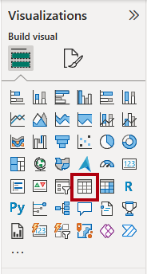
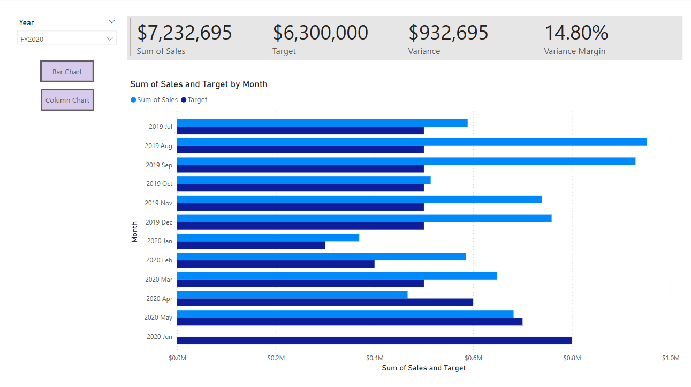
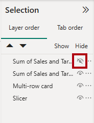

---
lab:
    title: 'Enhance Power BI report designs'
    module: 'Enhance Power BI report designs for the user experience'
---

# Enhance Power BI report design

## Lab story

In this lab, you'll enhance the _Sales Analysis_ report with advanced design features.

In this lab, you learn how to:

- Create a drill through page.
- Apply conditional formatting.
- Create and use bookmarks and buttons.

**This lab should take approximately 45 minutes.**

## Get started

To complete this exercise, first open a web browser and enter the following URL to download the zip file:

`https://github.com/MicrosoftLearning/PL-300-Microsoft-Power-BI-Data-Analyst/raw/Main/Allfiles/Labs/09-enhance-power-bi-reports/09-enhanced-report.zip`

Extract the file to the **C:\Users\Student\Downloads\09-enhanced-report** folder.

Open the **09-Starter-Sales Analysis.pbix** file.

> _**Note**: You may see a sign-in dialog as the file loads. Select **Cancel** to dismiss the sign-in dialog. Close any other informational windows. Select **Apply Later**, if prompted to apply changes._

## Configure a drillthrough page

In this exercise, you'll create a new page and configure it as a drillthrough page. When you've completed the design, the page will look like the following:

1. Create a new page and rename it as _Product Details_.

1. Right-click the **Product Details** page tab, and then select **Hide Page**.

    > _Report users won't be able to go to the drillthrough page directly. Instead, they'll access it from visuals on other pages. You'll learn how to drill through to the page in the final exercise of this lab._

1. Beneath the **Visualizations** pane, in the **Drill Through** section, add the `Product | Category` field to the **Add drill-through fields here** box.

    > _The labs use a shorthand notation to reference a field. It will look like this: `Product | Category`. In this example, `Product` is the table name and `Category` is the field name._

    

1. To test the drill through page, in the drill through filter card, select _Bikes_.

    

1. At the top left of the report page, notice the arrow button.

    > _The report designer automatically adds an arrow button when a field is added to the drill through well. It allows report users to navigate back to the page from which they drilled through._

1. Add a **Card** visual to the page, and then resize and position it so it sits to the right of the button and fills the remaining width of the page.

    

    

1. Drag the `Product | Category` field into the card visual.

1. Configure the format options for the visual to turn the **Category Label** property to **Off**.

    

1. In the **General** tab, in the **Effects** section, set the background color property to a light gray color (such as _White, 10% Darker_) to provide contrast.

    

1. Add a **Table** visual to the page, and then resize and position it so it sits beneath the card visual and fills the remaining space on the page.

    

    

1. Add the following fields to the visual:

    - `Product | Subcategory`
    - `Product | Color`
    - `Sales | Quantity`
    - `Sales | Sales`
    - `Sales | Profit Margin`

1. To configure the format options for the visual, in the **Grid** section, set the **Global font size** property to **20pt**.

    > _The design of the drillthrough page is almost complete. You'll enhance the page with conditional formatting in the next exercise._

## Add conditional formatting

In this exercise, you'll enhance the drillthrough page with conditional formatting. When you've completed the design, the page will look like the following:

1. Select the table visual. In **Columns** well, select the down-arrow on the **Profit Margin** field, and then select **Conditional formatting > Icons**.

    

1. In the **Icons – Profit Margin** window, in the **Icon Layout** dropdown list, select **Right of Data**.

    

1. To delete the middle rule, at the right of the yellow triangle, select **X**.

    

1. Configure the first rule (red diamond) as follows:

    - In the second control, remove the value
    - In the third control, select **Number**
    - In the fifth control, enter **0**
    - In the sixth control, select **Number**

1. Configure the second rule (green circle) as follows:

    - In the second control, enter **0**
    - In the third control, select **Number**
    - In the fifth control, remove the value
    - In the sixth control, select **Number**

    

    > _The rules can be interpreted as follows: display a red diamond if the profit margin value is less than 0; otherwise if the value is greater than or equal to zero, display a green circle._

1. In the **Icons – Profit Margin** window, in the **Apply to** dropdown list, select **Values and totals**.

    

1. Select **OK**.

1. In the table visual, verify that the correct icons are displayed.

    

1. Configure background color conditional formatting for the **Color** field.

1. In the **Background Color – Color** window, in the **Format Style** dropdown list, select **Field Value**.

    

1. In the **What field should we base this on?** dropdown list, in the _All data_ group, select the `Product | Formatting | Background Color Format` field.

    

1. Repeat the previous steps to configure font color conditional formatting for the **Color** field by using the `Product | Formatting | Font Color Format` field.

 > _You might recall that the background and font colors were source from the **ColorFormats.csv** file in the **Prepare Data in Power BI Desktop** lab, and then integrated with the **Product** query in the **Load Data in Power BI Desktop** lab._

## Add bookmarks and buttons

In this exercise, you'll enhance the _My Performance_ page with buttons, allowing the report user to select the visual type to display. When you've completed the design, the page will look like the following:

1. Go to the _My Performance_ page.

1. On the **View** ribbon tab, from inside the **Show Panes** group, select **Bookmarks**.

    

1. On the **View** ribbon tab, from inside the **Show panes** group, select **Selection**.

    

1. In the **Selection** pane, beside one of the _Sales and Target by Month_ items, to hide the visual, select the eye icon.

    

1. In the **Bookmarks** pane, select **Add**.

    

    > _Tip: To rename the bookmark, double-click the bookmark._

1. If the visible chart is the bar chart, rename the bookmark as _Bar Chart ON_, otherwise rename the bookmark as _Column Chart ON_.

1. To edit the bookmark, in the **Bookmarks** pane, hover the cursor over the bookmark, select the ellipsis, and then select **Data**.

    > _Disabling the **Data** option means the bookmark won't use the current filter state. That's important because otherwise the bookmark would permanently lock in the filter currently applied by the Year slicer._

    

1. To update the bookmark, select the ellipsis again, and then select **Update**.

    > _In the following steps, you'll create and configure a second bookmark to show the second visual._

1. In the **Selection** pane, toggle the visibility of the two _Sales and Target by Month_ items.

    > _In other words, make the visible visual hidden, and make the hidden visual visible._

    

1. Create a second bookmark, and name it appropriately (either _Column Chart ON_ or _Bar Chart ON_.

    

1. Configure the second bookmark to ignore filters (**Data** option off), and update the bookmark.

1. In the **Selection** pane, to make both visuals visible, simply show the hidden visual.

1. Resize and reposition both visuals so they fill the page beneath the multi-card visual, and completely overlap one another.

    > _To select the visual that is covered up, select it in the **Selection** pane._

    

1. In the **Bookmarks** pane, select each of the bookmarks, and notice that only one of the visuals is visible.

    > _The next stage of design is to add two buttons to the page. These buttons will allow the report user to select the bookmarks._

1. On the **Insert** ribbon, from inside the **Elements** group, select **Button**, and then select **Blank**.

    

1. Position the button directly beneath the _Year_ slicer.

1. Select the button, and then in the **Format button** pane, expand the **Style** section, and then set the **Text** section to **On**.

    

1. In the **Text** section, in the **Text** box, enter _Bar Chart_.

1. Set the **Fill** section to **On**, and then set a color by using a complementary color.

1. Set the **Action** section to **On**, and then set the **Type** property to **Bookmark**.

1. Select **Button** and turn the **Action** property to **On**.

1. Expand the **Action** section, and then set the **Type** dropdown list to **Bookmark**.

1. In the **Bookmark** dropdown list, select **Bar Chart ON**.

    

1. Create a copy of the button by using copy and paste, and then configure the new button as follows:

    > _Tip: The shortcut commands for copy and paste are **Ctrl+C** followed by **Ctrl+V**._

    - Set the button text to _Column Chart_.
    - Set the action bookmark to **Column Chart ON**.

    > _The design of the Sales Analysis report is now complete._

## Publish and explore the report

In this exercise, you'll publish the report to the Power BI service and explore the published report behavior.

> _**Note**: You'll need at least a **Power BI Free** license to publish the report. Open the Microsoft Edge browser, and navigate to_ `https://app.powerbi.com`_.  Sign in with the credentials for the Microsoft 365 tenant provided by your authorized lab hoster (ALH). When asked to solve a puzzle, or to start a free Fabric trial, you can skip this and close the browser._

> _**Note**: You can review the remainder of the exercise, even if you don't have access to the Power BI service to perform the tasks directly._

1. Select the _Overview_ page.

1. In the _Year_ slicer, select **FY2020**.

1. In the _Region_ slicer, ensure no regions are selected.

1. Save the Power BI Desktop file.

1. On the **Home** ribbon tab, from inside the **Share** group, select **Publish**.

    > _If you're not signed in to Power BI Desktop already, you'll need to first sign in before you publish the report._

    

1. In the **Publish to Power BI** window, notice that _My workspace_ is selected.

1. To publish the report, select **Select**. Wait until the publication completes.

1. When the publication succeeds, select **Got It**.

1. Close Power BI Desktop.

1. Open the Microsoft Edge browser, then sign in at `https://app.powerbi.com` (or use an existing browser session).

1. In the browser window, in the Power BI service, in the **Navigation** pane (located at the left, and it could be collapsed), select **My Workspace**.

1. To explore the report, select the _09-Starter-Sales Analysis_ report.

1. To test the drill through feature, in the _Overview_ page, in the _Sum of Quantity by Category_ visual, right-click the _Clothing_ bar, and then select **Drill Through > Product Details**.

    

1. Notice that the _Product Details_ page filters visuals for _Clothing_.

1. To return to the source page, at the top-left corner of the page, select the arrow button.

1. Go to the _My Performance_ page.

1. Select each of the buttons, and then notice that a different visual is displayed.

## Lab complete

1. Close Microsoft Edge browser.
1. Close Power BI Desktop.